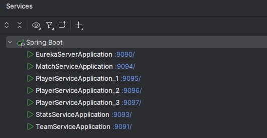
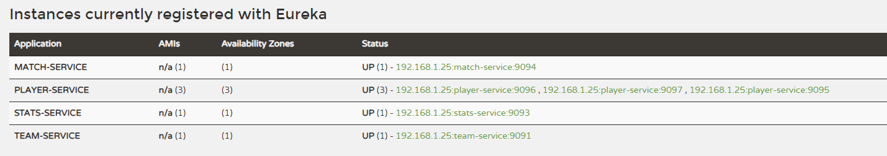

# Sport Management

Application CRUD avec 4 services différents qui communiquent entre eux.  
Fichiers de config IntelliJ présents dans chaque service..

### ✅ Partie 0.5 : Eureka localhost:9090
### ✅ Partie 1 : Service d'Équipes | localhost:9091/teams

### ✅ Partie 2 : Service de Joueurs | localhost:9092/players
### ✅ Partie 3 : Service de Matchs | localhost:9094/matches
### ✅ Partie 4 : Service de Stats  | localhost:9093/stats
### ✅ Partie 5 : Documentation Swagger | localhost:909{1-4}/swagger-ui/
### ✅ Partie 6 : Tolérance aux Pannes

Hystrix est activé dans TeamController, en cas d'appel infructeux de TeamController  
vers PlayerController, le circuit breaker est activé, et on retourne quand même  
l'équipe, mais sans les joueurs.  

Dashboard qui bug?

### ✅ Partie 7 : Monitoring  | localhost:909{1-4}/actuator/
### ✅ Partie 8 : Load Balancing 

Load balancing activé sur Player, qui se register 3 fois. 
Lorsqu'on appelle depuis Team des URL de player on les appelle via player-service, sans donner de port.  
Un des 3 ports déployés est alors choisi. Pour vérifier, voir la console de chacun des services.

### ❌ Partie 9 : Kubernetes 
